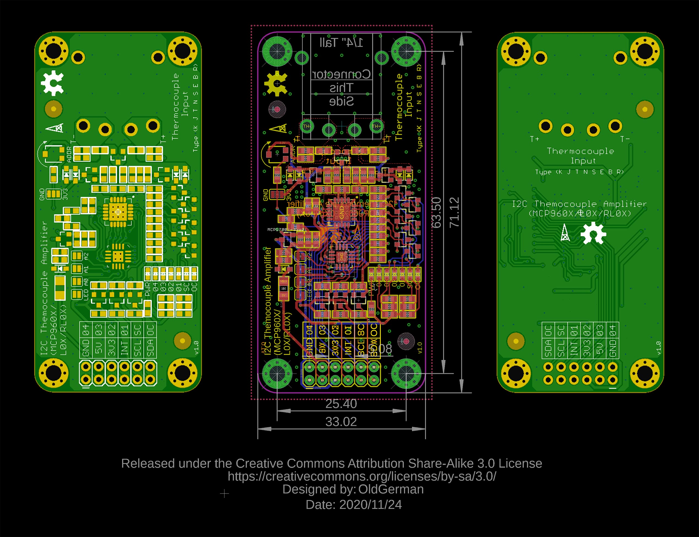
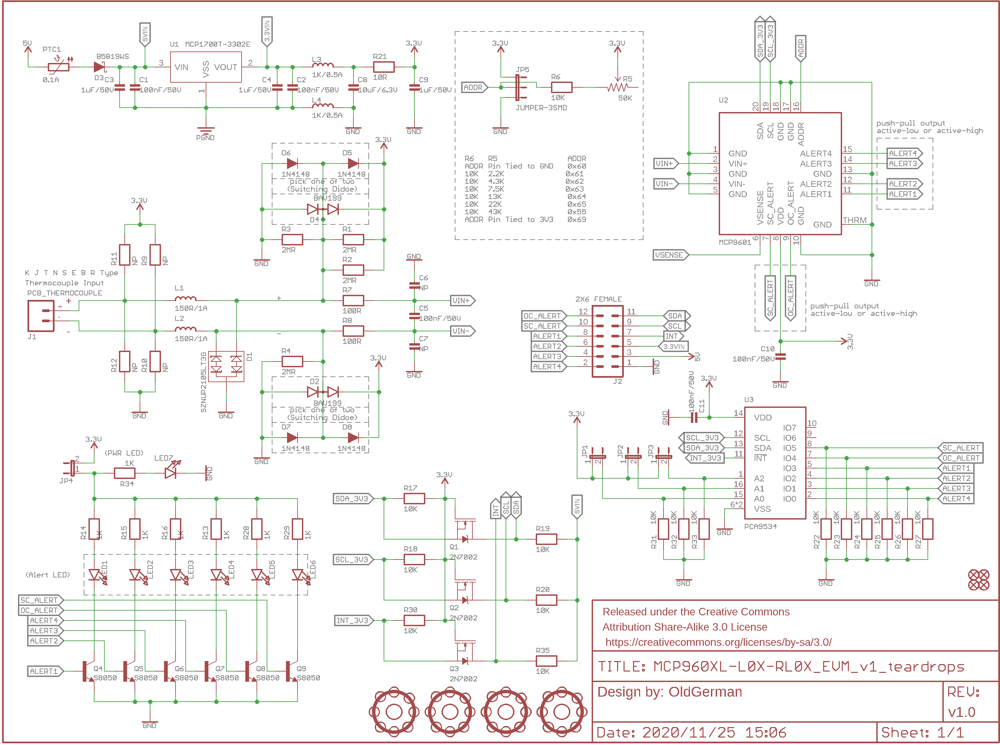

# MCP9600/MCP9601 Breakout, With PCA9534 IO Expander 

- The module has a bug, don’t make a board.
- 该模块有BUG，不要打板

## PCB

## SCH

## BOM

Please see bom/ibom.html

## Connectors

1. 5.08mm Pitch 2Pin Plug

2. [OMEGA Circuit Board Thermocouple Connectors](https://www.omega.com/en-us/temperature-measurement/temperature-connectors%2C-panels-and-block-assemblies/temperature-connectors/p/PCC-OST-SMP)

## Pictures

:confused:

## Libraries

1. [PCA9534](https://github.com/alotaiba/PCA9534)
2. [MCP9600](https://github.com/sparkfun/SparkFun_MCP9600_Arduino_Library)

## Reference

1. [Microchip：MCP9600 Evaluation Board](https://www.microchip.com/adm00665-063015a)

2. [Maxim：MAX31855PMB1 Peripheral Module](https://www.maximintegrated.com/en/products/sensors/MAX31855PMB1.html)

3. [Seeed：Grove - I2C Thermocouple Amplifier MCP9600](https://wiki.seeedstudio.com/Grove-I2C_Thermocouple_Amplifier-MCP9600/)

4. [SparkFun：Qwiic Thermocouple Amplifier - MCP9600](https://www.sparkfun.com/products/16294)

5. [Adafruit：MCP9600 I2C Thermocouple Amplifier](https://www.adafruit.com/product/4101)

## Test

MCP96RL01 + T12 irons TYPE-N

| Read Thermocouple(℃) | Read Ambient(℃) | Measurements(mV) | (Ref Junction 0℃) its 90 table for N Type(mV) | (Ref Junction 0℃) its 90 table for N Type(℃) | Read Ambient + its 90 table N Type  (℃) | error(℃) | Hot air gun(W) |
| -------------------- | --------------- | ---------------- | --------------------------------------------- | -------------------------------------------- | --------------------------------------- | -------- | -------------- |
| 100                  | 24.62           | 2.1              | 2.106                                         | 78                                           | 102.62                                  | 2.62     | 314            |
| 156                  | 24.75           | 3.8              | 3.803                                         | 135                                          | 159.75                                  | 3.75     | 500            |
| 180                  | 24.56           | 4.6              | 4.618                                         | 160                                          | 184.56                                  | 4.56     | 587            |
| 190                  | 25.37           | 4.8              | 4.809                                         | 167                                          | 192.37                                  | 2.37     | 600            |

## Alert 引脚的下拉电阻

MCP9601的6个Alert引脚均为推挽输出，复位后默认状态为Alert1~4输出高电平，OC Alert和SC Alert均使能，高电平表示OC触发，SC触发，或温度警报触发，无PCF9534时，6个Alert引脚不需要下拉电阻，Alert的3.3V高电平可正常输出给MCU

若焊接了PCF9534，则PCF9534复位的寄存器默认值将io 0~7配置为高阻抗输出驱动器的输入，输入电压可以升高到VDD以上，最大为5.5V，此时需要焊接所有Alert pins的下拉电阻，确保Alert的高电平为3.3V

## Important premise of the data sheet

### 3.4 Push-Pull Alert Outputs (Alert 1, 2, 3, 4 and OC/SC Alert)

Alert引脚是用户可编程的推挽输出，可用于检测温度上升或下降。当环境温度超过用户设置的温度警报极限时，设备输出**高电平**信号。 对于MCP9601 / L01 / RL01，当在VSENSE引脚上检测到开路和短路条件时，OC Alert和SC Alert输出才有效，这两个Alerts也是**高电平有效**推挽输出

### 6.3.3.1开路检测技术

mcp9600和mcp9601都具有开路检测技术（即使mcp9600没有VSENSE和OC Alert引脚），区别在于mcp9601的OC Alert引脚可以当作硬件指示器

对于MCP9600 / L00 / RL00开路检测，可以使用STATUS寄存器（寄存器5-6）的输入范围位（位4）来检测开路条件。这将需要一些外部电阻，如图6-6所示。无源电路不会影响MCP9600 / L00 / RL00的精度（RB的推荐值设置为1M。连接热电偶时，输入共模电压为 0.5×VDD。当热电偶断开连接，VIN +输入端的电压为 0.66×VDD，VIN-输入端的电压下拉至VSS。此更改将强制设置输入范围位。

MCP9601 / L01 / RL01开路检测机制的工作原理类似（请参见图6-7），检测阈值指定为VSiOC和VSiNOR（请参见DC特性）。主控制器可以立即轮询状态位以检测开路条件。对于MCP9601 / L01 / RL01，可以将OC Alert引脚用作硬件指示器。

